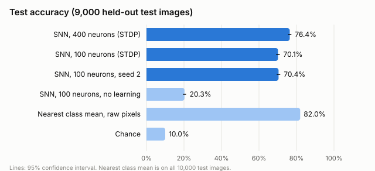
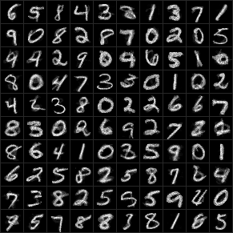
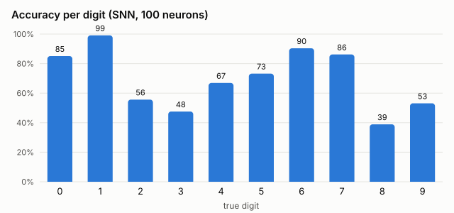
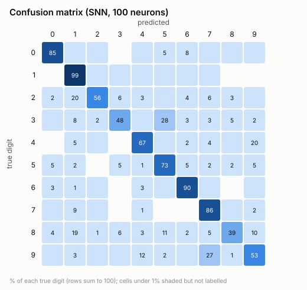
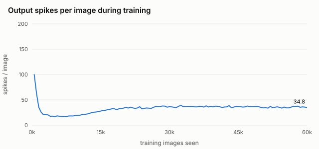
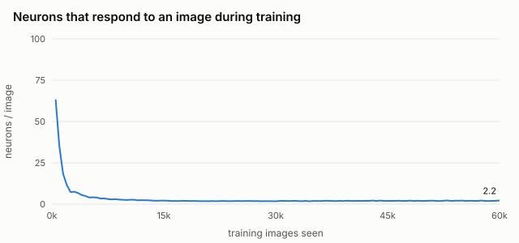

# Training brainy on MNIST

Brainy's spiking network (`snn/`) was trained to recognise handwritten
digits (MNIST) **without labels**: spike-timing-dependent plasticity (STDP)
and competition between neurons are the only learning. Labels are used
afterwards, only to name what each neuron has learned. The design follows
Diehl & Cook (2015), *Unsupervised learning of digit recognition using
spike-timing-dependent plasticity*.

## Results

| Model | Test accuracy, 9,000 held-out images | 95% CI |
|---|---|---|
| **brainy SNN, 100 neurons, STDP** | **70.1%** | 69.2-71.1 |
| brainy SNN, 100 neurons, STDP, second seed | 70.4% | 69.5-71.4 |
| brainy SNN, 400 neurons, STDP | (run in progress) | |
| Same network, learning off (random weights) | 20.3% | 19.5-21.1 |
| Nearest class mean on raw pixels (uses labels) | 82.0% | |
| Chance | 10.0% | |



"Held-out" means test images 1,000-9,999. All tuning decisions were made on
test images 0-999 (see [the tuning log](results/tuning/TUNING.md)), so only
the other 9,000 were never looked at before this run. On all 10,000 test
images the numbers are within 0.3 points of these.

What the 100 neurons learned: each square shows one neuron's 784 input
weights, and each has become a prototype of one digit.



## What was trained

```
 784 input neurons            100 excitatory            100 inhibitory
 (one per pixel,     STDP     (regular spiking,  1:1    (fast spiking)
  Poisson spikes,  ------->    adaptive         ------>      |
  up to 64 Hz)     plastic     threshold)                    |
                                   ^                         |
                                   +---- inhibits all -------+
                                         other excitatory
```

- **Data:** MNIST, 60,000 training and 10,000 test images of 28x28 pixels.
- **Encoding:** each pixel is an input neuron that fires randomly at up to
  64 Hz, in proportion to its brightness. Each image is shown for 350 ms.
  If the output layer fires fewer than 5 spikes, the image is shown again,
  brighter.
- **Learning (no labels):** input-to-excitatory synapses learn by STDP
  (a+ = 3e-4, a- = 9e-5). After every image each neuron's input weights are
  rescaled to a total of 1.5. Every output spike raises that neuron's
  threshold a little (0.02), so neurons that win too often step aside.
  Inhibition is slow (20 ms), so the first neuron to fire silences the
  others.
- **Training:** one pass over all 60,000 training images, about 45 minutes
  on one CPU core.
- **Readout (labels used here only):** with learning frozen, 10,000
  training images are shown. Each neuron is labelled with the digit it
  fired for most. A test image is classified as the digit whose neurons
  fired most (averaged per neuron).

Full settings: [results/final/settings.txt](results/final/settings.txt).

## Analysis

### 1. The network learns, and the result is reproducible

- With learning switched off, the same network and readout score 20.3%.
  Random weights already carry a little information (an image activates the
  pixels it covers), and the readout exploits it. STDP adds **50 points**
  on top.
- Two runs with different random seeds (initial weights, image order, input
  spikes) land 0.3 points apart, inside each other's confidence intervals.
- All 100 neurons are used, and every digit gets 6-15 neurons.

### 2. Where the accuracy goes

Three measurements on the same test images (1,000-9,999) separate *what was
learned* from *how it is read out*:

| | Accuracy |
|---|---|
| 100 ideal prototypes: k-means on raw pixels, nearest prototype | 88.9% |
| brainy's 100 learned prototypes, nearest prototype, no spikes | 78.1% (seed 2: 77.1%) |
| brainy's spiking network | 70.1% (seed 2: 70.4%) |

(`prototype_readout.cpp`: cosine similarity; each prototype labelled by
majority vote on the same 10,000 labelling images.)

- **About 11 points are lost in learning.** k-means places its 100
  prototypes to cover the data as well as possible. STDP with competition
  gets clean prototypes but a less useful spread: for example, "8" has 12
  neurons and still scores only 39%.
- **About 8 points are lost in the spiking readout.** The winner is decided
  by a race between noisy Poisson spike trains, not by exact similarity. On
  average only 2 neurons answer an image, so one unlucky race changes the
  answer.

### 3. Which digits fail, and why




- **Easy:** 1 (99%), 6 (90%), 7 (86%), 0 (85%). These have distinctive
  shapes with little overlap.
- **Hard:** 8 (39%), 3 (48%), 9 (53%), 2 (56%).
- **Main confusions:** 3 → 5 (28% of all 3s), 9 → 7 (27%), 4 → 9 (20%),
  2 → 1 (20%), 8 → 1 (19%). The first three are pairs whose templates
  overlap heavily; a single template per neuron cannot tell a 3's upper
  loop from a 5's.
- **"1" neurons take other digits:** 2s and 8s are called "1" about a fifth
  of the time. A plausible reason (not tested separately): every neuron's
  weights sum to the same total, so a thin "1" template has very large
  weights on the few central pixels it covers. Any image with a central
  vertical stroke drives it hard, and 2s and 8s have one.

### 4. Training dynamics: most learning happens in the first 5,000 images




- In the first 500 images about 63 neurons answer each image. By 5,000
  images it is 4, and after 20,000 about 2: the network has become
  winner-take-all.
- Accuracy barely moves with more data. A 5,000-image tuning run (run P)
  reached 71.2% on test images 0-999; the full 60,000 gives 70.1%. Once a
  neuron owns a digit shape, STDP only sharpens it.
- Output spikes per image first fall (competition sets in), then rise
  slowly from about 17 to 35. The thresholds keep climbing (mean 10 → 54),
  and a neuron that wins has to fire more to keep winning. Each image takes
  longer to simulate, but accuracy is unaffected.

### 5. Scaling to 400 neurons

(Run in progress.)

### 6. Compared with the paper

Diehl & Cook report 82.9% with 100 neurons and 87.0% with 400. brainy's
network gets about 13 points less at 100 neurons. The main differences:

- **Neurons:** they use leaky integrate-and-fire neurons with
  conductance-based synapses. brainy uses Izhikevich neurons with current
  synapses, whose inhibition can only subtract current. That makes the
  competition harder to tune, as the tuning log shows.
- **Learning rule:** their STDP depresses every input that did not fire
  just before an output spike. brainy's pair-based rule only potentiates
  active inputs and leaves the rest to weight normalisation.
- **Tuning:** these settings came from about 20 short runs. The paper's
  parameters were tuned much further.

## What the experiment changed in the library

Training on real data found one real bug and three missing pieces in
`snn/`, each now covered by tests (64 in total):

| Change | Why |
|---|---|
| **Bug fix:** membrane floor at -100 mV | Strong inhibition pushed the voltage so low that the Izhikevich quadratic overshot to a false spike. Inhibited neurons fired at ~280 Hz. |
| `tau_syn_inh`: separate, slower inhibitory time constant | With 5 ms inhibition, 100 neurons reach threshold in the same 2 ms and there is never a winner |
| Adaptive threshold (`enableAdaptiveThreshold`) | Neurons that win often step aside, spreading digits over neurons |
| `normalizeIncoming`, `setPlastic` | Weight normalisation; fixed wiring for the inhibitory circuit |

## Caveats

- Settings were tuned on test images 0-999. The headline numbers therefore
  use only test images 1,000-9,999. A cleaner protocol would tune on a
  validation split of the training set.
- One training pass, two seeds for 100 neurons, one seed for 400.
- The spiking readout is random (Poisson input), so repeating the test
  gives slightly different predictions. The two seeds give a sense of the
  spread.
- One CPU core. Simulating 1 ms per step with 784 inputs is the cost: about
  45 minutes to train 100 neurons, about 100 minutes for 400.

## Next steps (not done)

1. A validation split for tuning, then a clean test-set number.
2. Diehl & Cook's STDP variant, which depresses inputs that were silent
   before an output spike. It targets the 11-point learning gap.
3. Show each test image several times and add up the spikes. This targets
   the 8-point readout gap at the cost of speed.
4. Larger networks (1,600 neurons) need a faster step. Most time is spent
   drawing 784 random numbers per ms for the inputs.

## Reproduce

```
cd experiments/mnist
./fetch_mnist.sh                                   # downloads MNIST into data/
g++ -std=c++17 -O2 -I../../snn -o mnist_stdp mnist_stdp.cpp
./mnist_stdp --neurons 100 $(cat results/final/settings.txt) --seed 1 --out results/final/stdp_100
./mnist_stdp --neurons 100 $(cat results/final/settings.txt) --seed 1 --no-learning --out results/final/control_100
python3 analyze.py                                 # figures + summary.json
g++ -std=c++17 -O3 -o prototype_readout prototype_readout.cpp
./prototype_readout results/final/stdp_100_weights.png 100 --kmeans
```

Outputs per run in `results/final/`: `<run>.json` (accuracy, confusion
matrix, neurons per digit), `<run>_train.csv` (training curve),
`<run>_test_predictions.csv` (every test image), `<run>_weights.png`, and
`<run>.log`.
